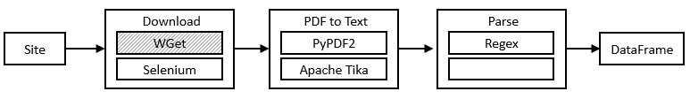
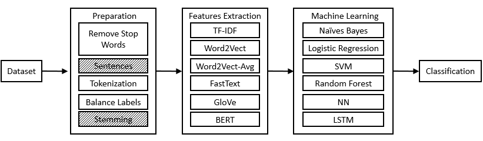
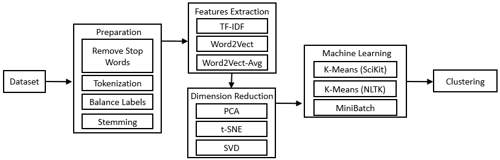
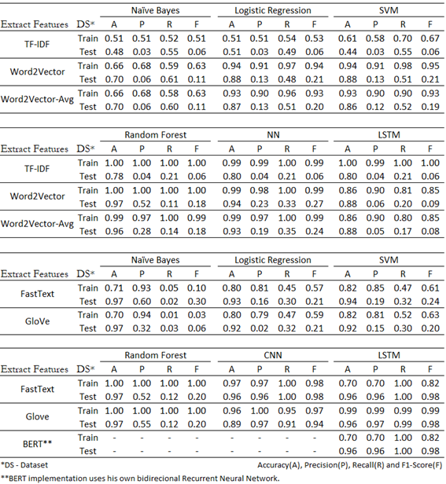

Natural Language Processing applied to Audit Reports
=============

Present the python codes for the research:

"NLP METHODS COMPARISON FOR CLASSIFICATION AND CLUSTERING OF FINDINGS IN AUDIT REPORTS"

Authors: Gustavo FLEURY && Induraj RAMAMURTHY
Oriented by: Rachid CHELOUAH

All Jupyter Notebooks are tested in Google Colab environment.

[Full report here.](Data_Analysis_for_Internal_Audit.pdf)

## Extract

## Classification

## Clustering

## Classification RESULTS:

